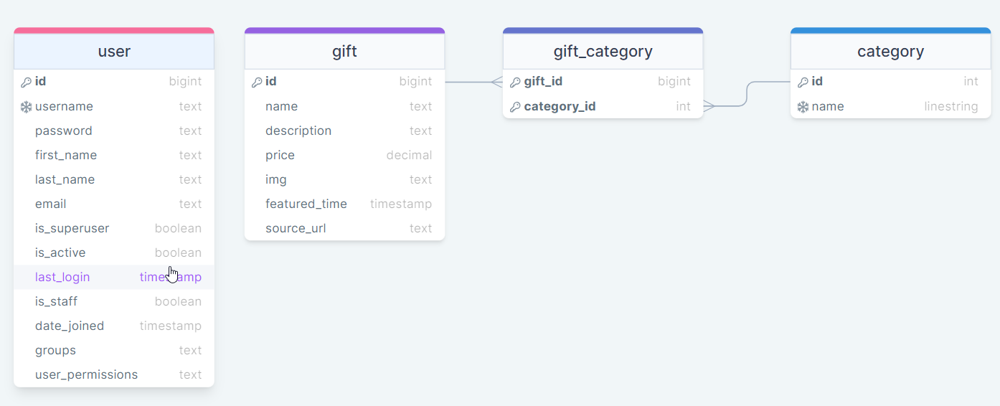

# Group Project Back End: Gift Compare website
By First Class Constructors Team - March 2024

This repo contains the `.gitignore` and `requirements.txt` you'll need to get started on your back end. A django project hasn't been created yet, so one person from the group will need to:

- clone the repo down
- create+activate a venv
- perform a `pip install` to install the modules listed in the `requirements.txt` file
- run `django-admin startproject YOUR_PROJECT_NAME_HERE` to launch a django project
- make a commit
- push to main

Then everyone else in the group can clone the repo down and get cracking! Have a look at the "Project Setup" notes from Thinkific if you need a refresher on how to get started creating the apps you need, and feel free to reach out to mentors for help!

Don't forget to use good Git technique and co-ordinate with each other to avoid merge conflicts!

## Concept/Name:
At Gift Compare, we're dedicated to simplifying the gift-buying experience, making every occasion a celebration of joy and connection. Our platform offers a curated selection of gifts for birthdays, weddings, graduations, and more.

You can browse trending gifts and explore gifts suggested by events and easily compare products across retailers. The ability to limit your search to your budget and event streamlines your experience so you can efficiently select a perfectly matched gift for your loved ones.

Whether you're a seasoned gift-giver or dread having to select one, Gift Compare is here to transform the act of giving into a joyful journey filled with excitement and heartfelt connections.

## Planning: 
This project used:
* Django Rest framework to build the backbone of the website/APIs. 
* Insomnia to show the APIs/Endpoints functionalities
* Fly.io to deploy the backend live version

## API Specs:
| **HTTP Method** |      **URL**     |                                            **Purpose**                                            |                                                                     **Request Body**                                                                     |                                                                                              **Successful Response Code**                                                                                             | **Authentication and Authorization** |
|:---------------:|:----------------:|:-------------------------------------------------------------------------------------------------:|:--------------------------------------------------------------------------------------------------------------------------------------------------------:|:---------------------------------------------------------------------------------------------------------------------------------------------------------------------------------------------------------------------:|:------------------------------------:|
| POST            | /api-token-auth/ | Returns an object with a token field containing the authentication token                          | { “username”: “”, “password”: “” }                                                                                                                       | 200 - success 500 - Internal Server Error - server crashed                                                                                                                                                            | N/A                                  |
| GET             | /users/          | Returns a list of User objects                                                                    | N/A                                                                                                                                                      | 200 - success 500 - Internal Server Error                                                                                                                                                                             | Only admin users                     |
| GET             | /users/id        | Returns the User object with the specified id                                                     | N/A                                                                                                                                                      | 200 - success 401 - Unauthorized - user is not logged in 403 - Forbidden - You are logged in but not allowed to access this resource 404 - Not Found - requested resource does not exist 500 - Internal Server Error  | authentication required              |
| POST            | /users/register/ | Create a User object and returns its persisted state                                              | { “username”: “”, “password”: “”, “email”: “”, “first_name”: “”, “last_name”: “”, “is_superuser”: false, “is_active”: true, “date_joined”: “timestamp” } | 200 - success and record added into the DB 400 - Bad Request - pass incorrect data/format in the Request Body 403 - Forbidden 500 - Internal Server Error                                                             | N/A                                  |
| GET             | /categories/     | Returns a list of Category objects                                                                | N/A                                                                                                                                                      | 200 - success 500 - Internal Server Error                                                                                                                                                                             | N/A                                  |
| POST            | /categories/     | Create a Category object and returns its persisted state (only if executed by the admin)          | { “name”: “”}                                                                                                                                            | 201 - success + record in DB 400 - Bad Request 401 - Unauthorized 403 - Forbidden 500 - Internal Server Error                                                                                                         | admin                                |
| GET             | /gifts/          | Returns a list of Gift objects                                                                    | N/A                                                                                                                                                      | 200 - success 500 - Internal Server Error                                                                                                                                                                             | N/A                                  |
| GET             | /gifts/id/       | Returns the Gift object with the specified id                                                     | N/A                                                                                                                                                      | 200 - success404 - Not Found 500 - Internal Server Error                                                                                                                                                              | N/A                                  |
| POST            | /gifts/          | Create a Gift object and returns its persisted state (only if executed by the admin)              | { “name”:””, “description:””, “price”: “”, “img”: “url”, “source”: “url”, “categories”:[categoryid,...] }                                                | 201 - success + record in DB 400 - Bad Request 401 - Unauthorized 403 - Forbidden 500 - Internal Server Error                                                                                                         | admin                                |
| PUT             | /gifts/id/       | Modify the Gift object with specified id and returns its new state(only if executed by the admin) | { “name”:””, “description:””, “price”: “”, “img”: “url”, “source”: “url”, “is_featured”: boolean }                                                       | 200 - success 400 - Bad Request 401 - Unauthorized 403 - Forbidden 500 - Internal Server Error                                                                                                                        | admin                                |
| GET             | /gifts/featured/ | Returns the array of Featured gifts                                                               | N/A                                                                                                                                                      | 200 - success                                                                                                                                                                                                         | N/A                                  |
| PUT             | /gifts/featured/ | Sets the Featured gifts with the ids being passed                                                 | [id1, id2, …]                                                                                                                                            | 204 - No Content 401 - Unauthorized 403 - Forbidden 500 - Internal Server Error                                                                                                                                       | admin                                |

## Features:
- Users can signup, login and see their details on the Profile page but, at this stage of the MVP do not interact with the rest of the website as requested by the Client;
- Necessary APIs use Token Authentication for appropriate user authentication and authorization;
- APIs returns the relevant status codes for both successful and unsuccessful requests to APIs;
- The handling of graceful failed requests will be part of frontend development;
- Responsive design will be part of frontend development.

## MVP DB schema: 
- 

## References:
- [GitHub Gift Compare backend Repo](https://github.com/SheCodesAus/2024_first_class_constructors_back_end).
